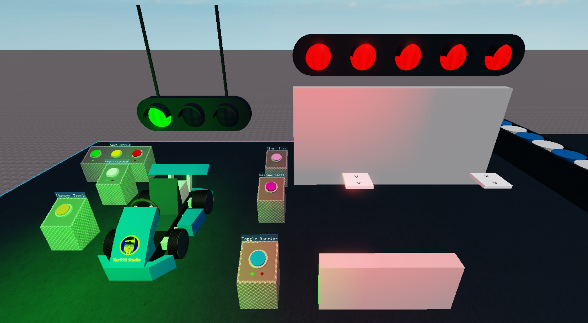

# Racing kit roblox

### What is this project?
This project is an open source go-kart kit that is avaliable on the Roblox [toolbox](https://create.roblox.com/marketplace/asset/3719396356/Racing-Kit). It allows developers to create their own Go-Karting game with minimal scripting. The kit includes features such as:
* Button controlled barriers
* Kart collision on/off
* Kart with anti-cheat
* Vehicle spawning
* Safety lights with kart speed limiter
* Starting lights
* Changing tracks

### How to run project
1. Download [Roblox Studio](https://www.roblox.com/create)
2. Download [Go-KartKit.rbxl](Go-KartKit.rbxl)
3. Open file through Roblox Studio "File" button or open [Go-KartKit.rbxl](Go-KartKit.rbxl)

### Additional notes
* You are more than welcome to fork and clone this repository
* Rojo has been set up for API and scripts. Follow Rojo setup steps and use this project file when runnning server: [default.project.json](default.project.json)

### Links
* [Model kit](https://www.roblox.com/library/3719396356/Yar890-Studio-Racing-Kit-ALPHA)  
* [DevForum instructions](https://devforum.roblox.com/t/yar890-studio-racing-kit-instructions/741217)  
* [Youtube tutorial](https://www.youtube.com/watch?v=HJhDu9wpGzY)  
